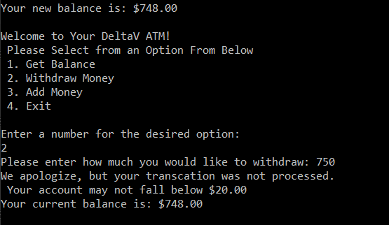
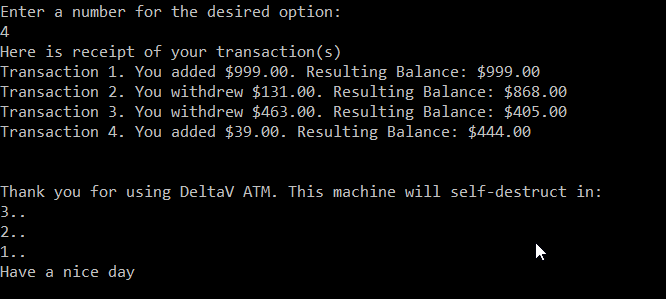

# Lab02UnitTesting
Lab02 Unit Testing: ATM

**Summary**: This purpose of this program is create a virtual ATM using C#. The program allows the user to see their balance, add money, and
withdraw money. When the user closes the application, it provides them with a list of transcations completed.

**Approach**: The main approach was to use Test Driven Development (TDD). This is where the programmer creates the test *first* and then 
works on developing the corresponding methods. This forces the developer to slow down and consider the application in a more step by 
step fashion, hopefulling minimizing errors and increasing efficiency. Only after all the tests are passing and the does the developer
then tie them together with the User Interface method, ShowMenu() in this case. The program also uses try/catch blocks to catch errors as they happen.

**WalkThrough**
1. The menu is displayed automatically, asking the user choose an option. After every step the user is returned to this menu until they choose Exit

;

2. When the user select option 1, the balance is displayed

3a. Selecting option 3 allows the user to input an amount to withdrawn from their account

3b. The program will not allow the balance to drop below $20, it the user tries it is rejected

4. Selecting option 4 allows the user to add money to the balance

5. After the user chooses to exit the program, the program will display a reciepet of transaction succesfully completed, and perhaps a fun message

